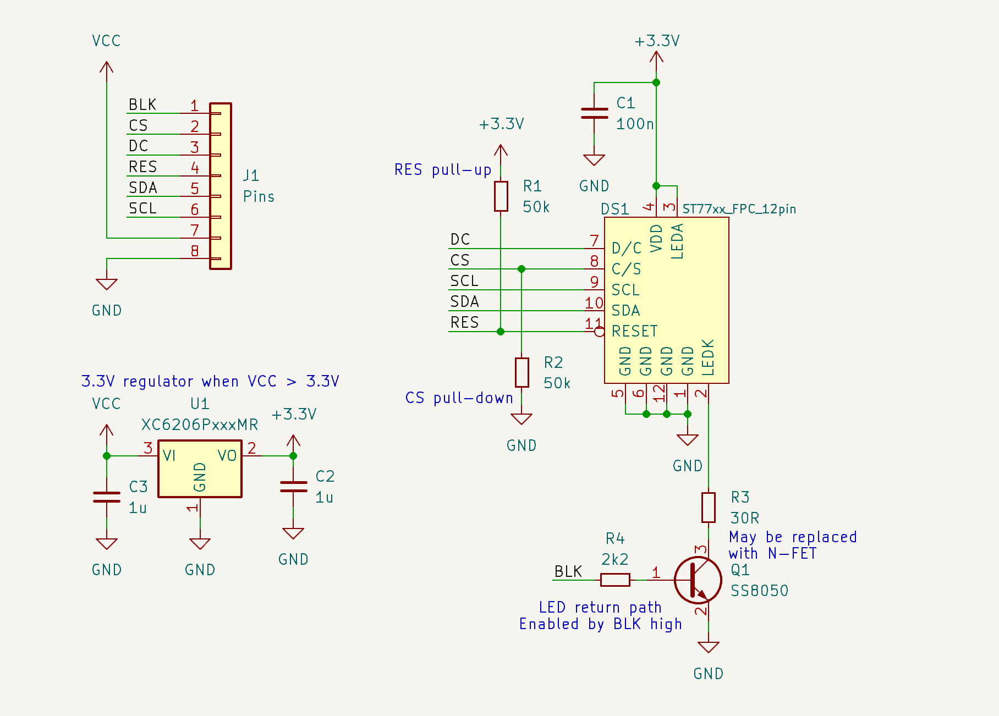

# ST77xx

Reverse engineering of ST7735/ST7789 breakout board for SPI TFT display.

J1 (Pins) is breakout connector.
J2 (Flex) is display flex connector (0.8mm pitch, 0.4x3mm pads)

Regulator is for 5V compatibility and could be omitted on 3.3V boards.

